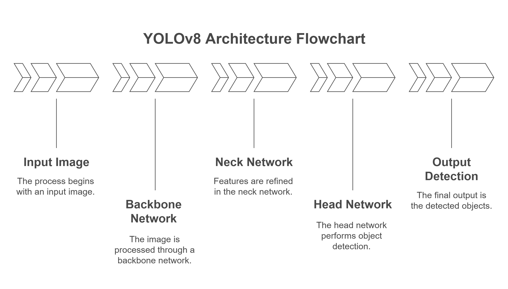
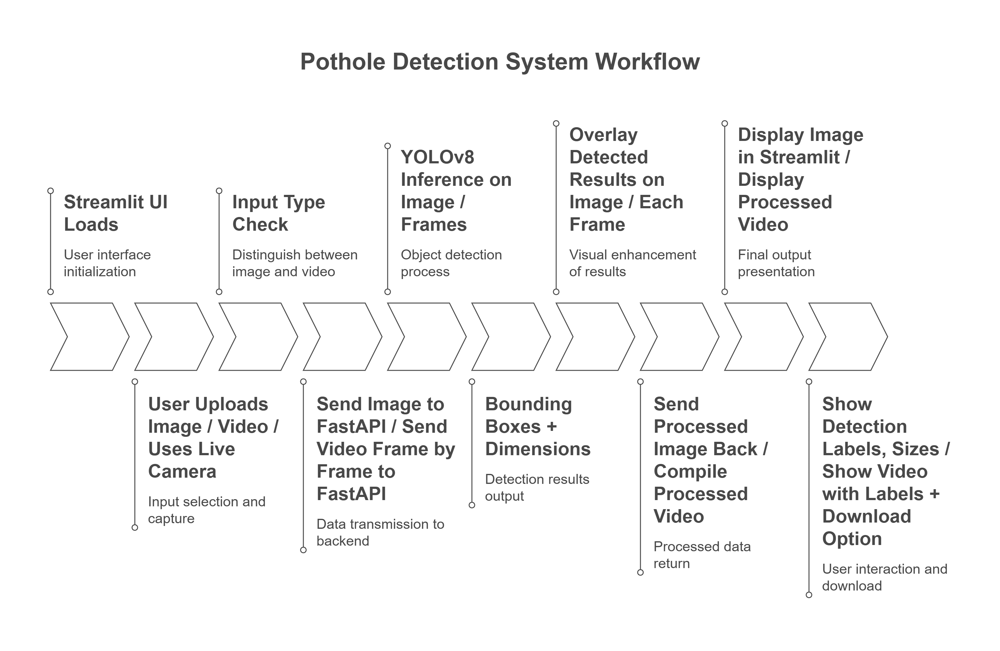
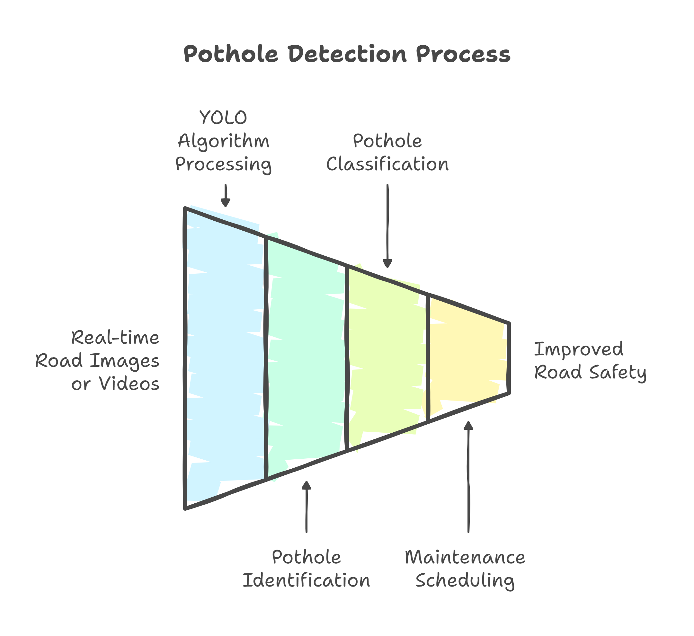

# 🚧 Pothole Dimension Detection System


---

## 🏁 Overview

> **Pothole Dimension Detection System** is an AI-powered application that automatically detects potholes and estimates their dimensions from images, videos, and real-time camera feeds. Built with **YOLOv8**, it helps improve road safety and supports smart city infrastructure.

---

<details>
<summary><strong>📋 Table of Contents (click to expand)</strong></summary>

- [Project Motivation](#project-motivation)
- [Key Features](#key-features)
- [YOLOv8 Model Details](#yolov8-model-details)
- [How the System Works](#how-the-system-works)
- [Application Goals](#application-goals)
- [Software & Hardware Requirements](#software--hardware-requirements)
- [File Structure](#file-structure)
- [Installation & Setup](#installation--setup)
- [Usage Guide](#usage-guide)
- [Future Enhancements](#future-enhancements)
- [Acknowledgments](#acknowledgments)
- [License](#license)
- [Contact](#contact)
</details>

---

## 🚦 Project Motivation

> Potholes cause accidents, vehicle damage, and traffic jams. Manual detection is slow and error-prone. This project automates pothole detection and measurement for:
>
> - Faster road assessment
> - Data-driven maintenance
> - Real-time alerts
> - Smart city integration

---

## ✨ Key Features

- 🔍 **Automated Detection:** YOLOv8, fine-tuned for Indian roads
- 📏 **Dimension Estimation:** Width & height in meters
- 🖼️ **Multi-Modal Input:** Images, videos, live camera (PC/mobile)
- 🖥️ **Streamlit UI:** Easy upload, preview, and download
- 📴 **Offline Capability:** Local FastAPI backend
- 🛠️ **Extensible:** GPS, voice alerts, cloud mapping (planned)
- 📊 **Reporting:** Annotated frames and overlays

---

## 🤖 YOLOv8 Model Details

> **How does YOLOv8 work?**  
> Think of YOLOv8 as your super-fast, super-smart friend who can spot potholes in any pic or video in milliseconds.  
> - **Speed & Accuracy:** Real-time, blink-and-you-miss-it detection  
> - **Lightweight:** Runs on your laptop, not just a beefy server  
> - **Instance Segmentation:** Draws boxes around potholes like a pro  
> - **Export Options:** Shareable in ONNX, TensorRT, CoreML formats

**Training Vibes:**  
- 📸 Custom dataset (Indian roads, Roboflow)  
- 🏷️ Bounding box annotation  
- 🔁 Transfer learning for pothole perfection

**Dimension Estimation:**  
- 📏 Converts pixels to meters (e.g., 1 pixel ≈ 1/320 m, but you can tweak it!)

---

## 🛠️ How the System Works

Ready for a quick ride? Here’s the workflow, GenZ style:

1. **Input:** Drop an image, video, or go live with your camera.  
2. **Preprocessing:** We resize and normalize your input (640x640 px, because that’s the sweet spot).  
3. **Detection:** YOLOv8 does its magic—finds potholes, draws boxes, and flexes its AI muscles.  
4. **Dimension Calculation:** Converts those box sizes to real-world meters.  
5. **Visualization:** You get annotated images/videos with size labels—share them, save them, flex them.  
6. **Post-processing:** Download your results, or just vibe with the previews.

---

### 🎨 Visuals & Flowcharts

#### YOLOv8 Architecture



*YOLOv8 is the core engine for pothole detection. This diagram shows how input images are processed through multiple neural network layers, enabling fast and accurate identification of potholes. Its streamlined design makes real-time detection possible, even on standard hardware.*

---

#### Detailed System Flowchart



*This flowchart maps out the entire detection pipeline: from uploading your data, preprocessing, running YOLOv8 inference, estimating dimensions, to visualizing and exporting results. Each step is clearly defined, making it easy to follow how your input becomes actionable insights.*

---

#### Application Workflow



*This workflow diagram highlights all user interactions with the app. Whether you’re uploading images, processing videos, or using real-time detection, it shows the path from input to output, helping you understand how to get the most from the system.*

---
## 🎯 Application Goals

- 🏙️ **Automate pothole logging:** Municipalities get instant road health updates.
- 🚗 **Real-time alerts for drivers:** Stay safe, avoid the bumps.
- 🏢 **Smart city AI analysis:** Next-level infrastructure planning.
- 📈 **Data-driven road repair decisions:** Fix what matters, when it matters.

---

## 💻 Software & Hardware Requirements

<details>
<summary><strong>Software</strong></summary>

- Python 3.10+
- Windows 10 / Linux / macOS
- Required packages (see `requirements.txt`):
  - ultralytics
  - streamlit
  - opencv-python
  - numpy
  - requests
  - pillow
  - fastapi
  - uvicorn
  - pyngrok (optional)
</details>

<details>
<summary><strong>Hardware</strong></summary>

- RAM: 4GB (8GB+ recommended)
- GPU: Optional, for faster inference
- Camera: PC webcam or mobile (DroidCam)
</details>

---

## 📁 File Structure

<details>
<summary>Click to expand</summary>

```
pothole-detection-system/
│
├── backend/
│   ├── app/
│   │   ├── main.py                # FastAPI backend
│   │   ├── yolo_inference.py      # Detection logic
│   │   └── realtime_detector.py   # Real-time detection module
│
├── model/
│   └── best.pt                    # Trained YOLOv8 model weights
│
├── streamlit_app.py               # Streamlit frontend
├── requirements.txt               # Python dependencies
├── assets/                        # Diagrams and flowcharts
│   ├── yolo_diagram.png
│   ├── detailed_flowchart.png
│   └── flowchart.png
├── README.md                      # Project documentation
```
</details>

---

## 🚀 Installation & Setup

1. **Clone the Repository:**
   ```sh
   git clone <repo-url>
   cd pothole-detection-system
   ```

2. **Install Python Dependencies:**
   ```sh
   pip install -r requirements.txt
   ```

3. **Download/Place YOLOv8 Model Weights:**
   - Place your trained `best.pt` file in the `model/` directory.

---

## 🧑‍💻 Usage Guide

<details>
<summary><strong>Backend Setup</strong></summary>

1. Open terminal in `backend/app/`
2. Start FastAPI server:
   ```sh
   uvicorn main:app --reload --port 8000
   ```
</details>

<details>
<summary><strong>Frontend Setup</strong></summary>

1. In project root, run:
   ```sh
   streamlit run streamlit_app.py
   ```
2. Open [http://localhost:8501/](http://localhost:8501/) in your browser.
</details>

<details>
<summary><strong>Using the Application</strong></summary>

- **Upload Image:** Detect potholes in a photo
- **Upload Video:** Detect potholes in videos
- **Real-Time Detection:** Use PC/mobile camera (DroidCam/Webcam)
- **Result Previews:** View, save, or download annotated frames
</details>

---

## 🔮 Future Enhancements

- 🗺️ GPS tagging for pothole mapping
- 🔊 Voice alerts for drivers
- ☁️ Cloud sync for centralized analysis
- 📱 Mobile app (Android/iOS)
- 🏷️ Damage severity classification

---

## 🙏 Acknowledgments

- **Ultralytics YOLOv8**
  - [GitHub](https://github.com/ultralytics/ultralytics)
  - License: GPL-3.0
- **Flickr Pothole Dataset / Roboflow**
  - [Roboflow Universe](https://universe.roboflow.com)
  - License: CC BY 4.0

---

## 📜 License

See [LICENSE](LICENSE) for details.

---

## 📬 Contact

For questions, suggestions, or contributions, please contact the project owner or open an issue in the repository.
